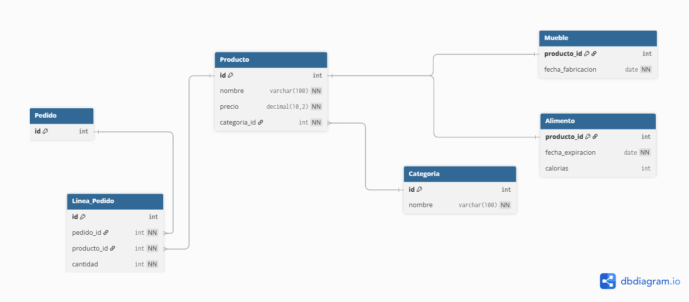
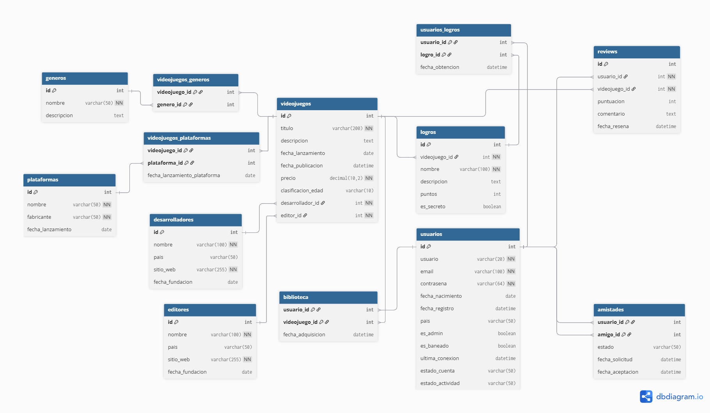

# TALLER 01 - BASE DE DATOS II

## 📋 Descripción del Proyecto

Este taller implementa dos bases de datos relacionales completas aplicando conceptos fundamentales de **DDL (Data Definition Language)** y **DML (Data Manipulation Language)**, normalizacion de datos y diseño de diagramas entidad-relación con cardinalidad.

## 🎯 Objetivos del Taller

1. **Diseño de Diagrama Entidad-Relación**: Aplicar conceptos de cardinalidad y relaciones entre entidades
2. **Normalización de Base de Datos**: Implementar reglas de normalización para optimizar la estructura
3. **Implementación DDL/DML**: Ejecutar procesos de definición y manipulación de datos usando contenedores
4. **Documentación de Conexión**: Documentar el proceso de conexión usando CLI y cliente gráfico

## 📁 Estructura del Proyecto

```
TALLER_01/
├── README.md                      # Documentación del proyecto
├── taller_01.sql                  # Script BD de tienda (productos, categorías, pedidos)
├── taller_01_bd_videojuegos.sql   # Script BD de videojuegos (tipo Steam)
├── taller_01.png                  # Diagrama ER de la BD de tienda
└── videojuegos_db.png             # Diagrama ER de la BD de videojuegos
```

## 🗄️ Bases de Datos Implementadas

### 1. Base de Datos de Tienda (`taller_01.sql`)

**Propósito**: Sistema de gestión de productos con categorización y pedidos

**Entidades Principales**:
- **Categoria**: Clasificación de productos
- **Producto**: Información base de productos (superclase)
- **Alimento**: Subtipo con fecha de expiración y calorías
- **Mueble**: Subtipo con fecha de fabricación
- **Pedido**: Órdenes de compra
- **Linea_Pedido**: Detalle de productos por pedido

**Características**:
- ✅ Herencia implementada (Producto → Alimento/Mueble)
- ✅ Relaciones 1:N (Categoria → Producto, Pedido → Linea_Pedido)
- ✅ Relaciones N:M (Producto ↔ Pedido a través de Linea_Pedido)
- ✅ Normalización aplicada (3FN)

### 2. Base de Datos de Videojuegos (`taller_01_bd_videojuegos.sql`)

**Propósito**: Plataforma de videojuegos tipo Steam con gestión completa de usuarios, juegos y funcionalidades sociales

**Entidades Principales**:
- **usuarios**: Gestión de cuentas de jugadores
- **videojuegos**: Catálogo de juegos
- **generos / plataformas**: Clasificación y compatibilidad
- **desarrolladores / editores**: Información de estudios
- **biblioteca**: Juegos por usuario (relación N:M)
- **reviews**: Sistema de reseñas y puntuaciones
- **logros**: Sistema de achievements
- **amistades**: Red social entre usuarios

**Características**:
- ✅ Modelo complejo con 12+ tablas interrelacionadas
- ✅ Múltiples relaciones N:M (usuarios-videojuegos, videojuegos-géneros, etc.)
- ✅ Sistema de seguridad (contraseñas hasheadas)
- ✅ Datos de prueba completos (15 videojuegos, 5 usuarios, reviews, logros)
- ✅ Consultas analíticas incluidas

## 🔧 Tecnologías Utilizadas

- **SGBD**: MySQL 8.0+
- **Contenedor**: Docker
- **Cliente CLI**: MySQL Command Line
- **Cliente Gráfico**: phpMyAdmin / MySQL Workbench

## 📊 Diagramas Entidad-Relación

### Diagrama BD Tienda


**Cardinalidades Implementadas**:
- Categoria (1) ← → (N) Producto
- Producto (1) ← → (1) Alimento/Mueble (Herencia)
- Pedido (1) ← → (N) Linea_Pedido
- Producto (N) ← → (M) Pedido

### Diagrama BD Videojuegos


**Cardinalidades Implementadas**:
- Usuario (N) ← → (M) Videojuego (biblioteca)
- Videojuego (N) ← → (M) Género
- Videojuego (N) ← → (M) Plataforma
- Usuario (1) ← → (N) Review
- Usuario (N) ← → (M) Usuario (amistades)

## 🚀 Instrucciones de Implementación

### 1. Configuración del Contenedor Docker

```bash
# Crear y ejecutar contenedor MySQL
docker run --name mysql-taller01 \
  -e MYSQL_ROOT_PASSWORD=root123 \
  -e MYSQL_DATABASE=taller01 \
  -p 3306:3306 \
  -d mysql:8.0

# Verificar que el contenedor esté ejecutándose
docker ps
```

### 2. Conexión mediante CLI

```bash
# Conectar usando MySQL CLI
mysql -h localhost -P 3306 -u root -p

# Ejecutar scripts
mysql -h localhost -P 3306 -u root -p < taller_01.sql
mysql -h localhost -P 3306 -u root -p < taller_01_bd_videojuegos.sql
```

### 3. Conexión mediante Cliente Gráfico

**phpMyAdmin**:
```bash
# Ejecutar phpMyAdmin en Docker
docker run --name phpmyadmin \
  -d --link mysql-taller01:db \
  -p 8080:80 \
  phpmyadmin/phpmyadmin
```
- URL: `http://localhost:8080`
- Usuario: `root`
- Contraseña: `root123`

**MySQL Workbench**:
- Host: `localhost`
- Puerto: `3306`
- Usuario: `root`
- Contraseña: `root123`

## 🧪 Pruebas y Validación

### BD Tienda - Consultas de Ejemplo
```sql
-- Ver productos con categorías
SELECT p.nombre, c.nombre as categoria, p.precio 
FROM Producto p 
JOIN Categoria c ON p.categoria_id = c.id;

-- Ver alimentos próximos a vencer
SELECT p.nombre, a.fecha_expiracion, a.calorias 
FROM Producto p 
JOIN Alimento a ON p.id = a.producto_id 
WHERE a.fecha_expiracion <= DATE_ADD(CURDATE(), INTERVAL 7 DAY);
```

### BD Videojuegos - Consultas Analíticas
```sql
-- Top 5 videojuegos mejor calificados
SELECT v.titulo, ROUND(AVG(r.puntuacion), 2) as promedio 
FROM videojuegos v 
LEFT JOIN reviews r ON v.id = r.videojuego_id 
GROUP BY v.id 
ORDER BY promedio DESC LIMIT 5;

-- Usuarios más activos
SELECT u.usuario, COUNT(b.videojuego_id) as juegos_biblioteca 
FROM usuarios u 
LEFT JOIN biblioteca b ON u.id = b.usuario_id 
GROUP BY u.id 
ORDER BY juegos_biblioteca DESC;
```

## 📈 Aspectos de Normalización

### Primera Forma Normal (1FN)
- ✅ Eliminación de valores multivaluados
- ✅ Atomicidad de datos en todas las columnas

### Segunda Forma Normal (2FN)
- ✅ Eliminación de dependencias funcionales parciales
- ✅ Separación de entidades relacionadas

### Tercera Forma Normal (3FN)
- ✅ Eliminación de dependencias transitivas
- ✅ Optimización de consultas y almacenamiento

## 👥 Información del Desarrollador

**Estudiante**: Aaron E. Newball P. 
**Asignatura**: Base de Datos II  
**Fecha**: Octubre de 2025  
**Repositorio**: [BASE_DE_DATOS_II](https://github.com/anxwball/BASE_DE_DATOS_II)

## 📚 Referencias y Recursos

- Documentación MySQL 8.0
- Principios de Normalización de Bases de Datos
- Diseño de Diagramas Entidad-Relación
- Docker para Desarrollo de Bases de Datos

---