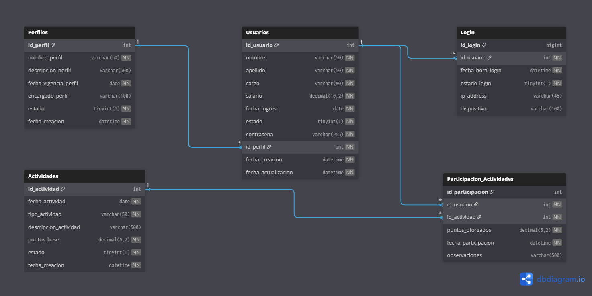

# Sistema de Fidelización XYZ
## Base de Datos de Gestión de Usuarios y Fidelización de Colaboradores


---

## 📋 Descripción del Proyecto

Este proyecto implementa una **base de datos relacional completa** para la empresa XYZ, diseñada para gestionar colaboradores, perfiles de usuario y un sistema integral de fidelización del personal. El sistema hace énfasis en el uso de **vistas SQL avanzadas** que facilitan el análisis de datos y la toma de decisiones gerenciales.

### Objetivo

Proveer una solución de base de datos que permita:
- Gestionar información de usuarios y sus perfiles
- Registrar y monitorear la autenticación de usuarios
- Administrar un programa de fidelización basado en puntos por participación en actividades
- Generar reportes analíticos mediante vistas SQL para la toma de decisiones

---

## Arquitectura del Sistema

### Módulos Implementados

El sistema está compuesto por **4 módulos principales** con sus respectivas tablas:

1. **Módulo de Usuarios**: Gestión completa de colaboradores
2. **Módulo de Perfiles**: Roles y permisos organizacionales
3. **Módulo de Fidelización**: Sistema de puntos por actividades
4. **Módulo de Login**: Auditoría de accesos al sistema

### Diseño de la Base de Datos

#### 1. Gestión de Colaboradores (Usuarios)

La tabla `Usuarios` almacena la información de cada colaborador con los siguientes atributos:
- Información personal: nombre, apellido
- Información laboral: cargo, salario, fecha_ingreso
- Estado del usuario: activo/inactivo
- Seguridad: contraseña (hash)
- Relación: un perfil activo por usuario

#### 2. Sistema de Autenticación (Login)

La tabla `Login` registra cada intento de inicio de sesión con:
- Fecha y hora exacta del intento
- Estado del login (exitoso/fallido)
- Información adicional: IP address, dispositivo
- Relación directa con el usuario que intenta autenticarse

#### 3. Módulo de Fidelización

El sistema de fidelización se compone de dos tablas:

**Tabla Actividades:**
- Registra actividades corporativas realizadas cada 15 días
- Atributos: fecha, tipo, descripción, puntos base
- Estado de la actividad (programada, realizada, cancelada)

**Tabla Participacion_Actividades:**
- Vincula usuarios con actividades
- Registra puntos otorgados por participación
- Permite seguimiento histórico de participaciones

#### 4. Perfiles de Usuarios

La tabla `Perfiles` gestiona roles organizacionales:
- Nombre y descripción del perfil
- Fecha de vigencia
- Encargado del perfil
- Preparada para integración futura con tabla de permisos

---

## 📊 Datos de Simulación Implementados

Para demostrar el funcionamiento completo del sistema, se implementó un conjunto robusto de datos de prueba:

### Volumen de Datos
-  **20 Usuarios** con diferentes roles y cargos
-  **10 Perfiles** distintos (Administrador, Gerente, Supervisor, Analista, etc.)
-  **100 Registros de autenticación** con estados exitosos y fallidos
-  **24 Actividades de fidelización** (2 por mes durante 12 meses)
-  **Más de 180 participaciones** de usuarios en actividades

### Tipos de Actividades Implementadas
1. **Capacitación**: Talleres de liderazgo, Excel, seguridad, comunicación
2. **Deportivas**: Torneos de fútbol, volleyball, caminatas, maratones
3. **Voluntariado**: Limpieza ambiental, donación de sangre, visitas a hogares
4. **Culturales**: Concursos de talentos, festivales, eventos temáticos
5. **Bienestar**: Manejo de estrés, salud integral, yoga y meditación
6. **Sociales**: Aniversarios, celebraciones, día de la familia

### Cálculo de Puntos de Fidelización
El sistema calcula automáticamente los puntos acumulados por cada usuario durante 12 meses, permitiendo:
- Evaluación del desempeño en fidelización
- Identificación de colaboradores destacados
- Análisis de participación por perfil
- Generación de reportes de tendencias

---

## 🔍 Vistas SQL Implementadas

El sistema implementa **3 vistas principales** que facilitan el análisis de datos sin requerir consultas complejas repetitivas:

### 1. Vista de Desempeño de Colaboradores (`v_DesempenoColaboradores`)

Esta vista proporciona una visión integral del rendimiento de cada colaborador en el programa de fidelización.

**Campos incluidos:**
- `nombre_completo`: Nombre y apellido del colaborador
- `cargo`: Posición actual en la empresa
- `salario`: Remuneración del colaborador
- `fecha_ingreso`: Fecha de incorporación a la empresa
- `total_puntos_fidelizacion_acumulados`: Suma total de puntos ganados
- `promedio_puntos_por_actividad`: Media de puntos obtenidos por actividad
- `estado_fidelizacion`: Clasificación calculada basada en puntos:
  - **Excelente**: > 500 puntos
  - **Bueno**: 200-500 puntos
  - **Regular**: < 200 puntos
- `dias_desde_ultimo_login`: Días transcurridos desde el último acceso exitoso

**Utilidad:**
- Identificar colaboradores destacados
- Detectar personal inactivo
- Evaluar la participación general

### 2. Vista de Actividades por Perfil (`v_actividadesPorPerfil`)

Analiza la distribución de participación en actividades según el tipo de perfil de los usuarios.

**Campos incluidos:**
- `nombre_perfil`: Nombre del rol/perfil
- `descripcion_perfil`: Descripción detallada del perfil
- `cantidad_usuarios_con_este_perfil`: Número de colaboradores con este rol
- `total_actividades_participadas_por_perfil`: Suma de participaciones del perfil
- `promedio_puntos_por_usuario_en_este_perfil`: Media de puntos por usuario
- `porcentaje_participacion_total`: Porcentaje de participación respecto al total

**Utilidad:**
- Identificar perfiles con baja participación
- Diseñar planes de incentivos específicos
- Comparar desempeño entre departamentos

### 3. Vista de Historial de Login Detallado (`v_historialLoginDetallado`)

Proporciona un registro detallado de todos los intentos de autenticación con análisis temporal.

**Campos incluidos:**
- `nombre_usuario`: Nombre del usuario
- `apellido_usuario`: Apellido del usuario
- `cargo_usuario`: Cargo del usuario
- `fecha_hora_login`: Timestamp exacto del intento
- `estado_login`: Exitoso (1) o Fallido (0)
- `tiempo_desde_anterior_login_minutos`: Diferencia en minutos desde el login anterior

**Utilidad:**
- Auditoría de seguridad
- Análisis de patrones de uso
- Detección de anomalías
- Seguimiento de accesos no autorizados

---

## 📈 Consultas de Negocio Implementadas

El sistema incluye consultas SQL que aprovechan las vistas para responder preguntas gerenciales clave:

### 1. Top 5 Colaboradores con Mejor Desempeño en Fidelización

```sql
SELECT nombre_completo, cargo, total_puntos_fidelizacion_acumulados, estado_fidelizacion
FROM v_DesempenoColaboradores
ORDER BY total_puntos_fidelizacion_acumulados DESC
LIMIT 5;
```

**Propósito:** Identificar a los colaboradores más comprometidos para posibles reconocimientos o promociones.

### 2. Perfiles con Menor Participación que Requieren Incentivos

```sql
SELECT nombre_perfil, descripcion_perfil, cantidad_usuarios_con_este_perfil, 
       total_actividades_participadas_por_perfil, promedio_puntos_por_usuario_en_este_perfil,
       porcentaje_participacion_total
FROM v_actividadesPorPerfil
ORDER BY total_actividades_participadas_por_perfil ASC, porcentaje_participacion_total ASC
LIMIT 5;
```

**Propósito:** Detectar departamentos o roles que necesitan planes de motivación específicos.

### 3. Usuarios Inactivos (Sin Login en 30+ Días)

```sql
SELECT nombre_completo, cargo, dias_desde_ultimo_login, total_puntos_fidelizacion_acumulados
FROM v_DesempenoColaboradores
WHERE dias_desde_ultimo_login > 30 OR dias_desde_ultimo_login IS NULL
ORDER BY dias_desde_ultimo_login DESC;
```

**Propósito:** Identificar personal que podría estar desvinculándose o tener problemas de acceso.

### 4. Reporte Mensual de Logins Exitosos vs. Fallidos

```sql
SELECT DATE_FORMAT(fecha_hora_login, '%Y-%m') AS mes, estado_login, COUNT(*) AS cantidad_logins
FROM v_historialLoginDetallado
GROUP BY mes, estado_login
ORDER BY mes, estado_login;
```

**Propósito:** Monitorear la seguridad del sistema y detectar patrones de intentos fallidos.

---

## 🗂️ Estructura del Proyecto

```
TALLER_02/
│
├── data/
│   └── scripts/
│       └── fidelizacion_xyz_db.sql    # Script completo de la base de datos
│
├── docs/
│   ├── README.md                      # Esta documentación
│   └── assets/                        # Recursos adicionales (diagramas, imágenes)
│
└── [Diagrama ERD en formato DBML]     # Modelo Entidad-Relación
```

---

## 🚀 Instalación y Uso

### Requisitos Previos
- MariaDB 12.0.2 o superior
- Cliente MariaDB/MySQL (HeidiSQL, DBeaver, MySQL Workbench, o línea de comandos)

### Pasos de Instalación

1. **Clonar el repositorio:**
   ```bash
   git clone https://github.com/anxwball/BASE_DE_DATOS_II.git
   cd BASE_DE_DATOS_II/TALLER_02
   ```

2. **Ejecutar el script SQL:**
   ```bash
   mariadb -u tu_usuario -p < data/scripts/fidelizacion_xyz_db.sql
   ```
   
   O desde el cliente MariaDB:
   ```sql
   SOURCE c:/Users/Aaron Newball/Desktop/BASE_DE_DATOS_II/TALLER_02/data/scripts/fidelizacion_xyz_db.sql;
   ```

3. **Verificar la instalación:**
   ```sql
   USE fidelizacion_xyz;
   SHOW TABLES;
   ```

4. **Probar las vistas:**
   ```sql
   SELECT * FROM v_DesempenoColaboradores LIMIT 10;
   ```

---

## 📐 Diagrama Entidad-Relación (ERD)

### Modelo Conceptual



### Relaciones Clave
- **Usuarios ↔ Perfiles**: Relación muchos a uno (N:1)
- **Usuarios ↔ Login**: Relación uno a muchos (1:N)
- **Usuarios ↔ Participacion_Actividades**: Relación uno a muchos (1:N)
- **Actividades ↔ Participacion_Actividades**: Relación uno a muchos (1:N)

---

## 🎓 Lecciones Aprendidas

### Desafíos Encontrados

1. **Cálculo de tiempo entre logins consecutivos:**
   - **Desafío:** Obtener la diferencia temporal entre logins del mismo usuario requería una subconsulta correlacionada.
   - **Solución:** Se implementó `TIMESTAMPDIFF` con una subconsulta que busca el login inmediatamente anterior usando `ORDER BY DESC LIMIT 1`.
   - **Aprendizaje:** Las subconsultas correlacionadas son poderosas pero requieren optimización cuidadosa.

2. **Manejo de valores NULL en agregaciones:**
   - **Desafío:** Usuarios sin participaciones generaban NULL en las sumas, afectando los promedios.
   - **Solución:** Uso extensivo de `COALESCE()` para convertir NULL en valores por defecto (0).
   - **Aprendizaje:** Siempre considerar casos extremos (usuarios nuevos, sin datos históricos).

3. **Clasificación dinámica del estado de fidelización:**
   - **Desafío:** Crear categorías basadas en rangos de puntos de forma eficiente.
   - **Solución:** Implementación de `CASE WHEN` anidado en la vista.
   - **Aprendizaje:** Las vistas pueden incluir lógica de negocio compleja que se reutiliza fácilmente.

4. **Cálculo de porcentajes de participación:**
   - **Desafío:** División por cero cuando no hay participaciones.
   - **Solución:** Uso de `NULLIF()` para evitar divisiones por cero.
   - **Aprendizaje:** Validar operaciones matemáticas contra valores problemáticos.

### Soluciones Implementadas

1. **Optimización de vistas:**
   - Uso de índices implícitos en claves primarias y foráneas
   - LEFT JOIN para preservar registros sin relaciones
   - Agrupamiento eficiente con GROUP BY

2. **Diseño normalizado:**
   - Separación clara de entidades (usuarios, perfiles, actividades)
   - Tabla intermedia para relaciones N:M (Participacion_Actividades)
   - Evitación de redundancia de datos

3. **Seguridad y auditoría:**
   - Campo de contraseña preparado para hashing
   - Registro detallado de intentos de login
   - Campos de timestamp automáticos

### Aprendizajes Clave

1. **Las vistas simplifican consultas complejas:** En lugar de repetir JOINs y subconsultas, las vistas encapsulan la lógica.

2. **El diseño de datos influye en el rendimiento:** La normalización correcta facilita consultas y mantenimiento.

3. **La documentación es crucial:** Un sistema bien documentado facilita el mantenimiento y escalabilidad.

4. **Los datos de prueba revelan problemas:** La simulación de 12 meses de datos permitió detectar casos extremos.

5. **SQL permite análisis sofisticado:** Con funciones de ventana, subconsultas y vistas, SQL puede resolver problemas analíticos complejos.

---

## 👤 Autor

**Aaron Newball**  
Taller de Base de Datos II  
Noviembre 2025

---

## 📝 Licencia

Este proyecto es parte de un taller académico de Base de Datos II.

---

## 🔗 Referencias

- [Documentación oficial de MariaDB](https://mariadb.com/kb/en/documentation/)
- [MariaDB 12.0 Release Notes](https://mariadb.com/kb/en/release-notes/)
- [SQL Style Guide](https://www.sqlstyle.guide/)
- [Database Design Best Practices](https://www.geeksforgeeks.org/dbms/database-design-ultimate-guide/)